#Word Window Classification, Neural Networks, and Matrix Calculus 

## 1. Classification review/introduction

Softmax & logistic regression

NLL loss / cross-entropy loss

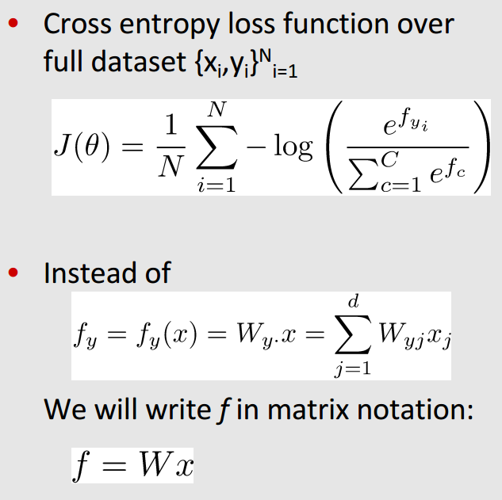

## 2. Neural Networks introduction

Neural Networks as non-linear, advanced classifiers.

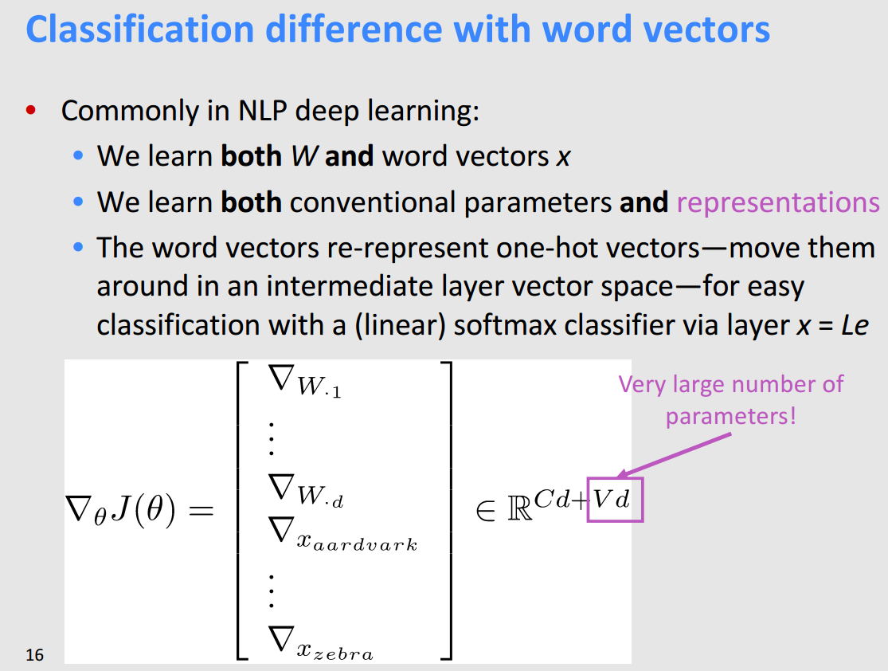

## 3. Named Entity Recognition

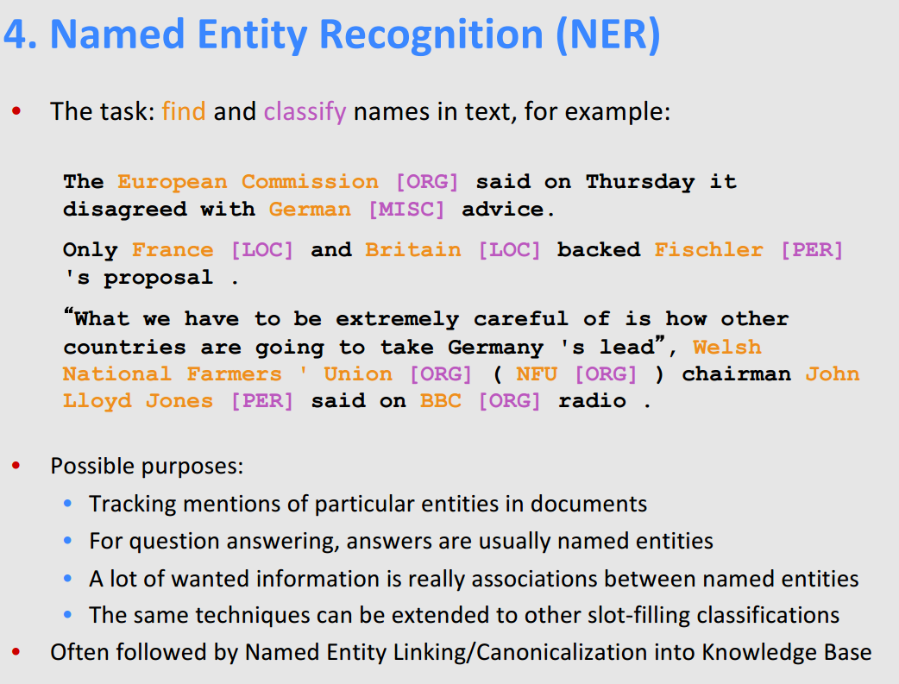

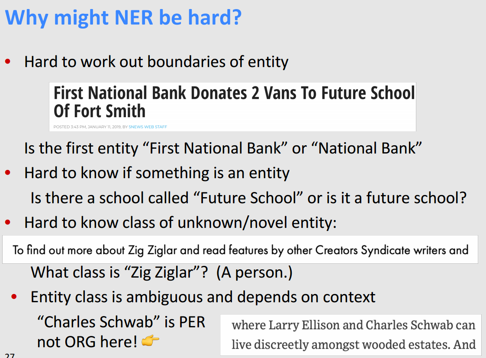

## 4. Binary true vs. corrupted word window classification

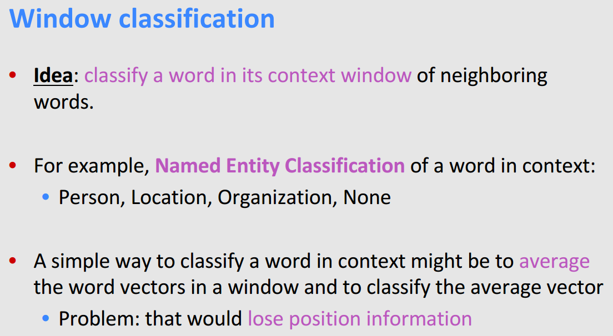

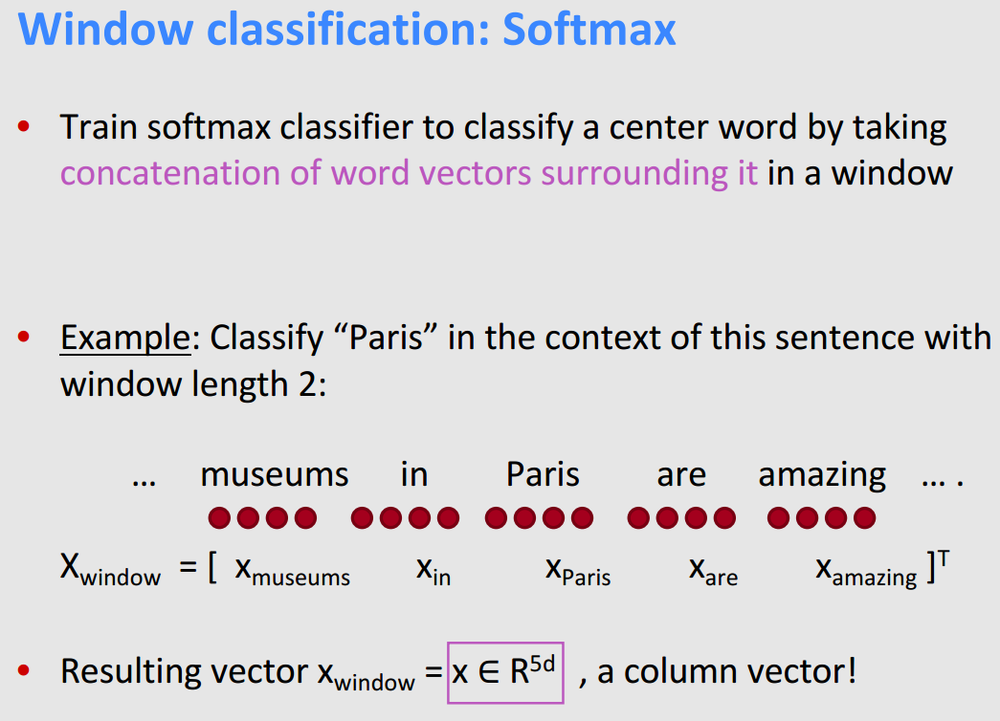

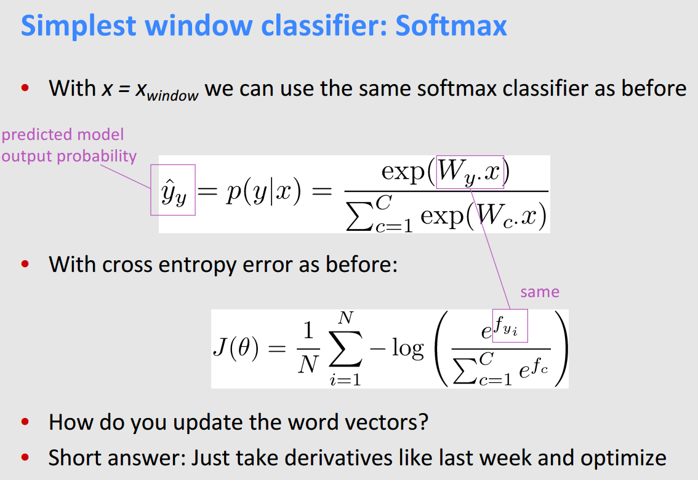

 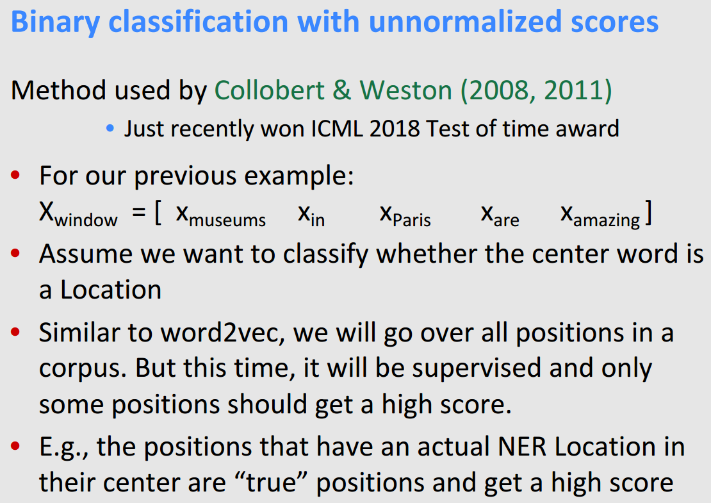

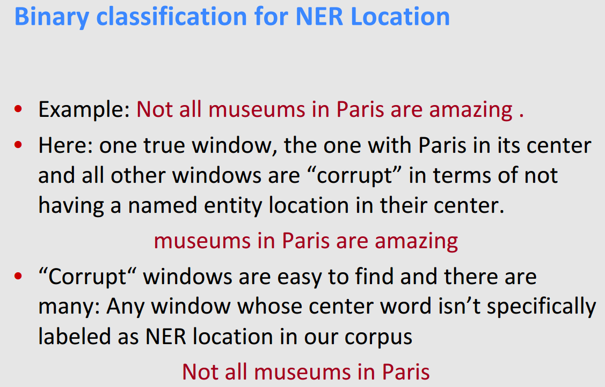

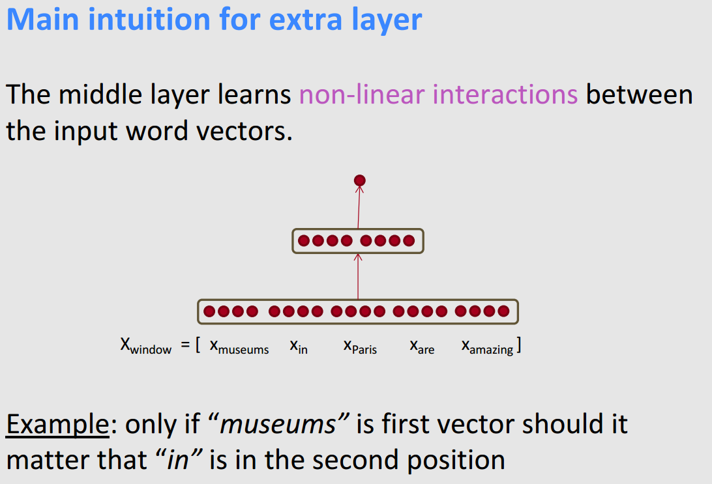

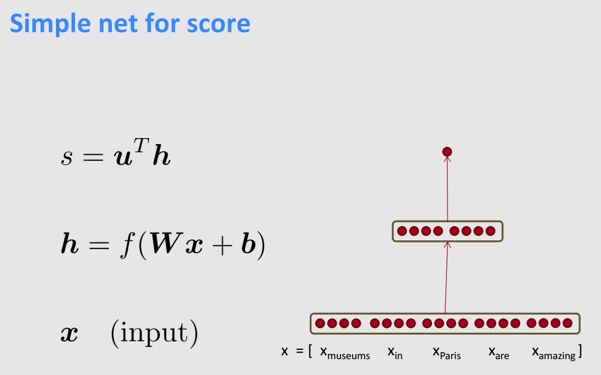

## 5. Matrix Calculus

**Gradient Descend? Matrix Calculus!**

