# Backpropagation and computation graphs

## 1. Matrix gradients for a simple neural net and tips

 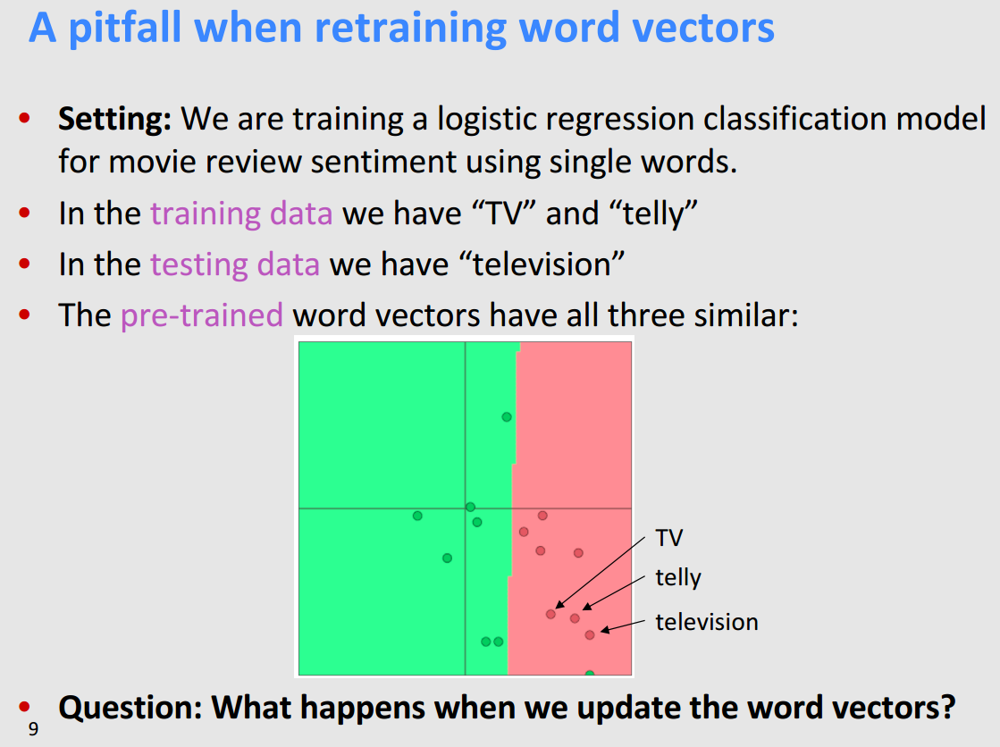

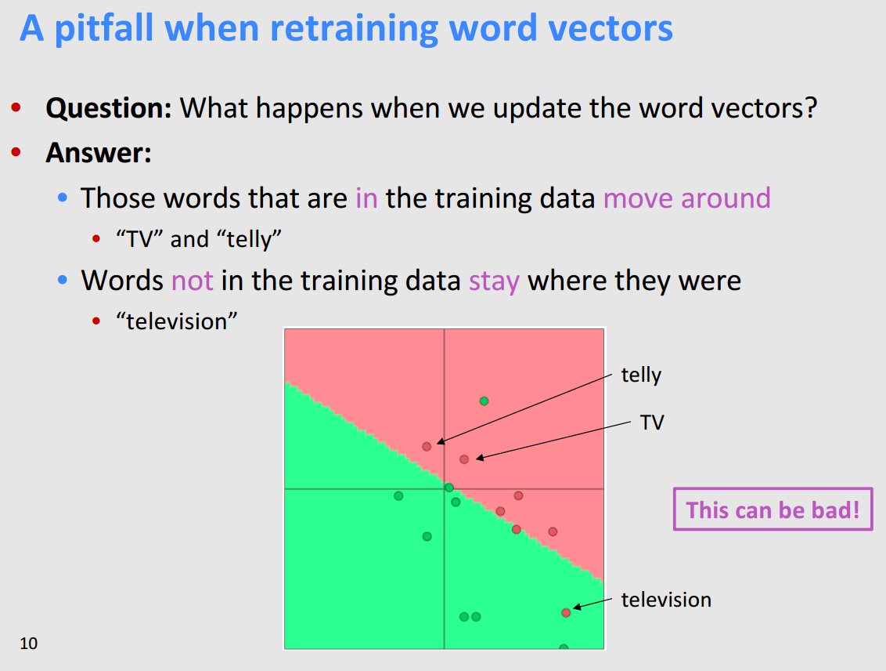

## 2. Computation graphs and backpropagation

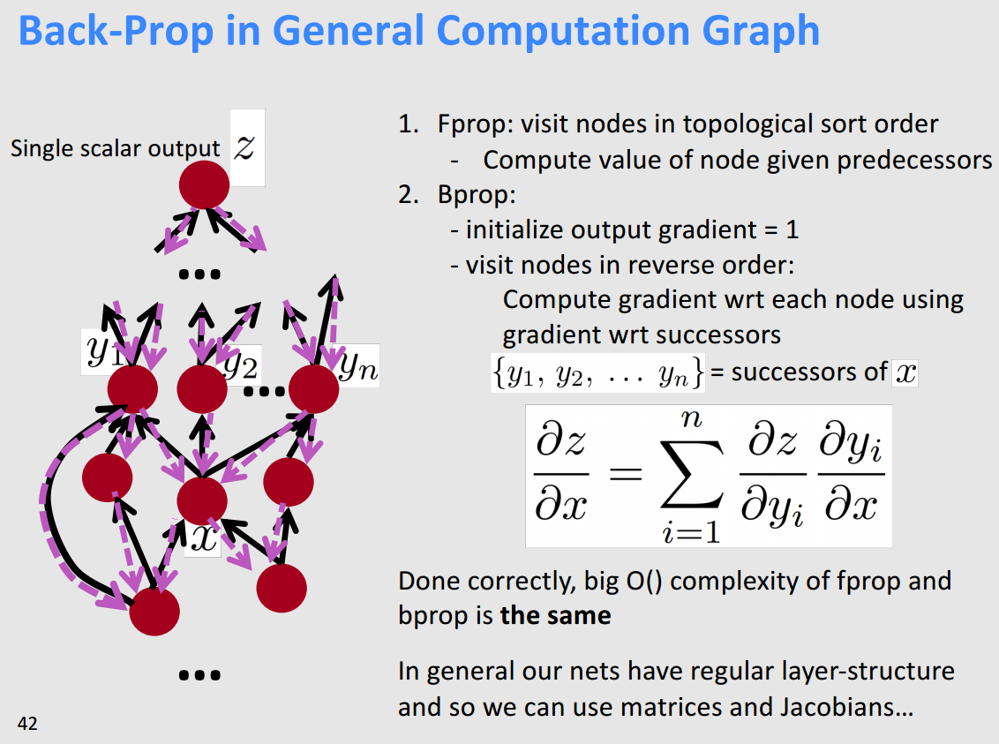

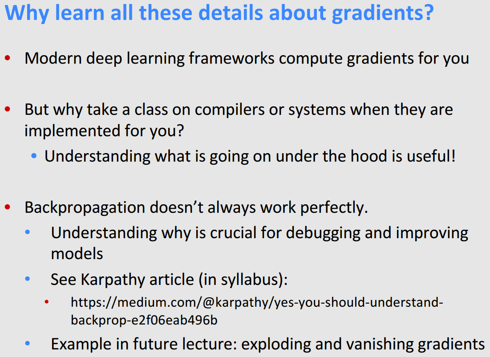

## 3. Stuff you should know

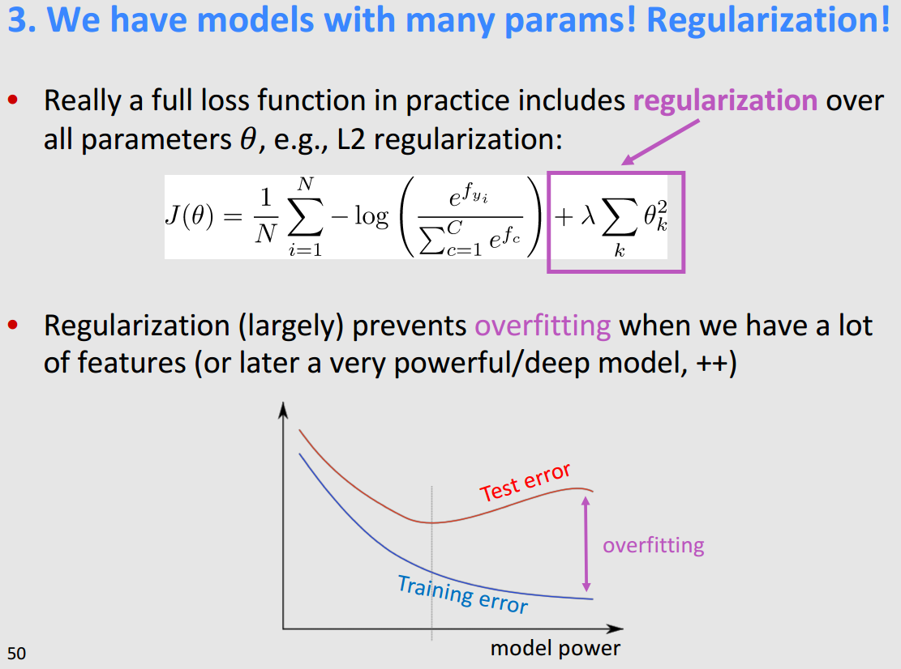

 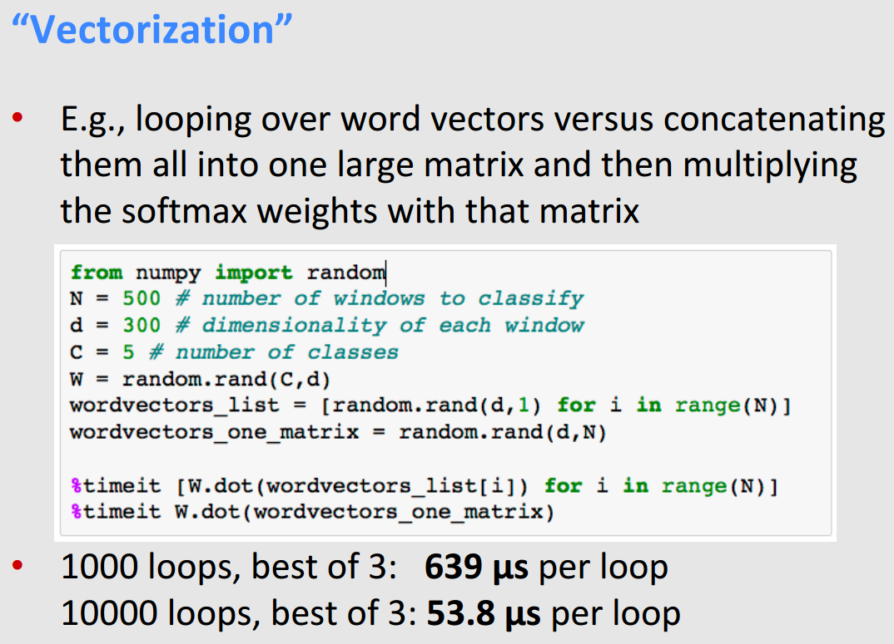

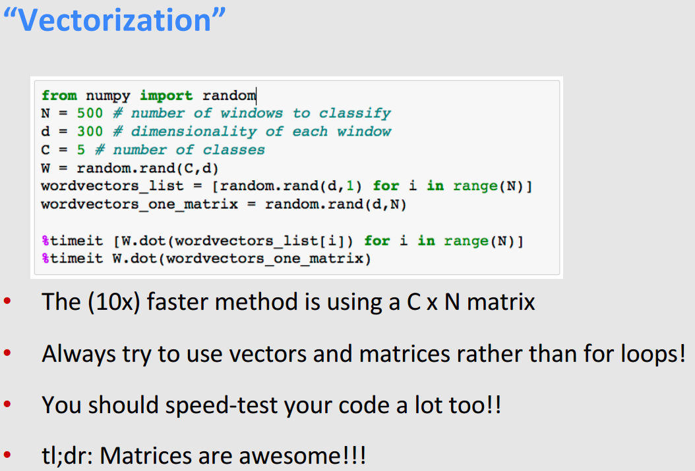

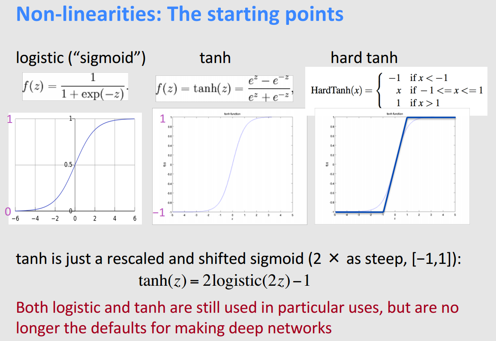

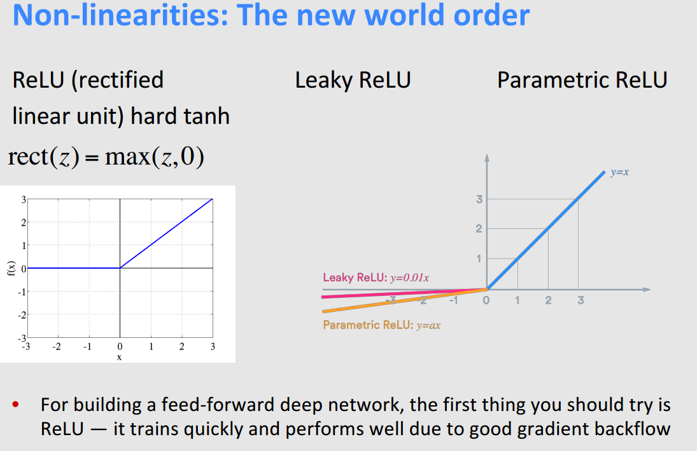

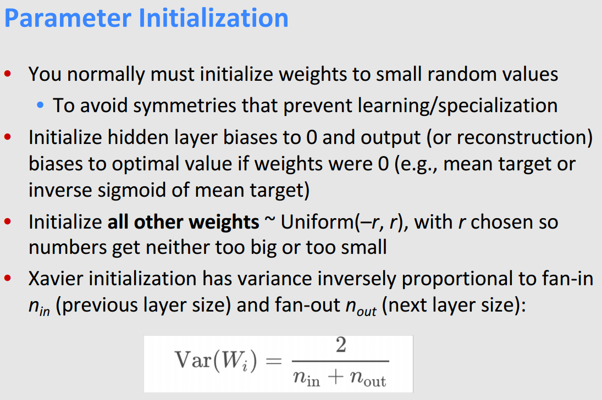

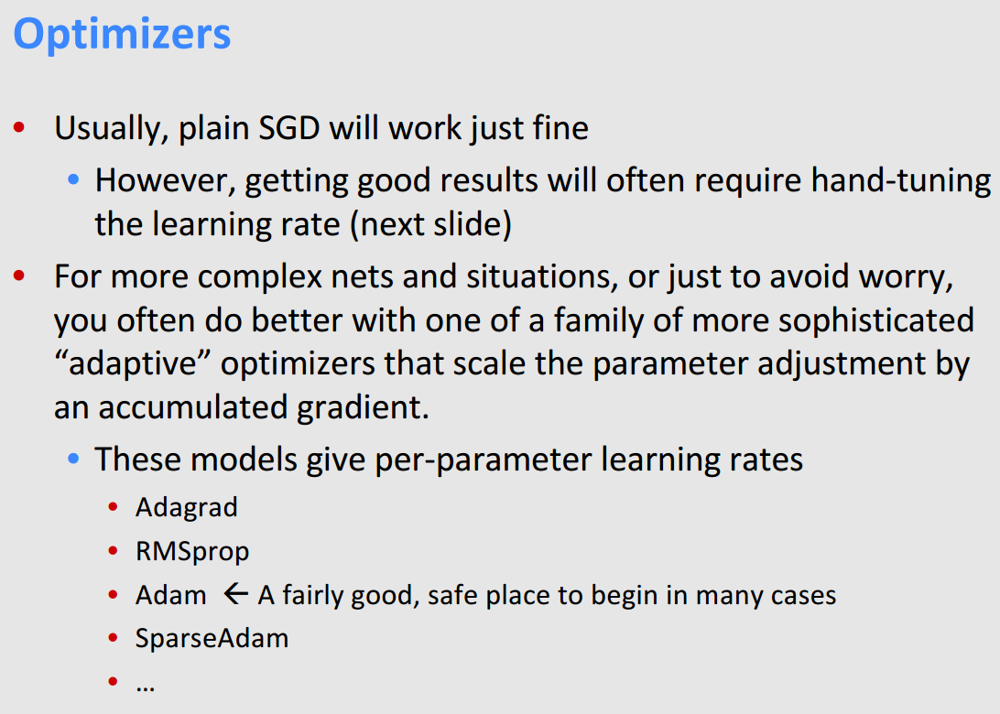

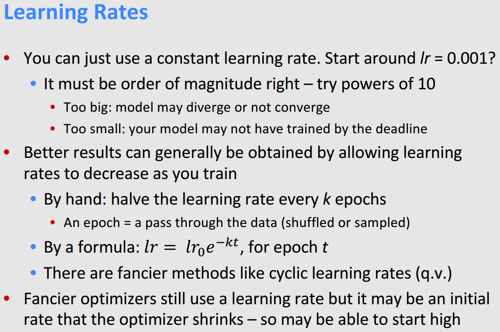

